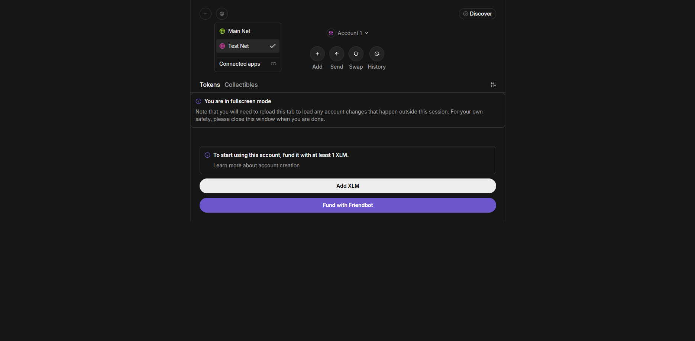
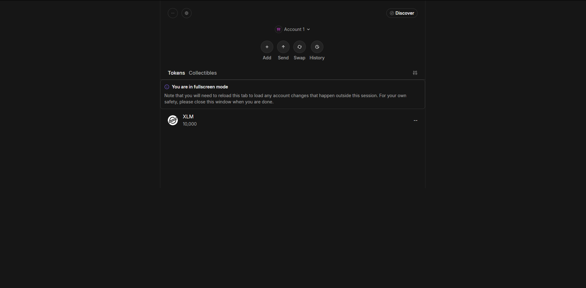
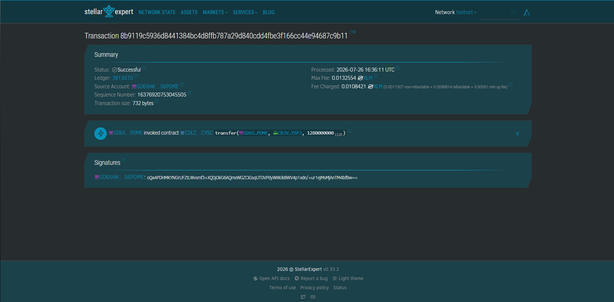
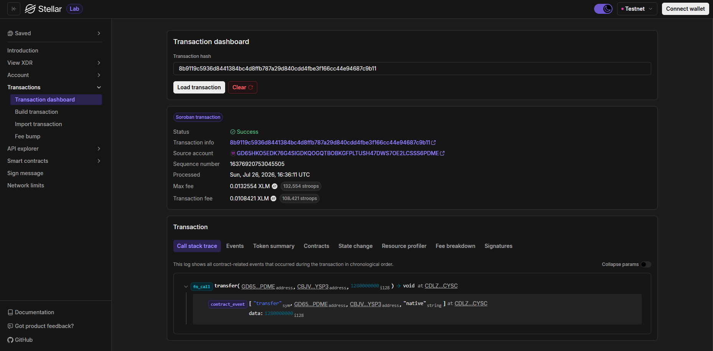

# Stellar Soroban - Level 1: White Belt

**Stellar Soroban - Level 1** focuses on the core fundamentals of Stellar and Soroban development on the Stellar Testnet: wallet setup, balance handling, and testnet transactions.

---

## 🎯 Level 1 Objectives

1. **Wallet Setup**: Set up a Stellar Wallet (Freighter / Stellar CLI identity) on **Stellar Testnet**.
2. **Wallet Connection & Funding**: Fund the wallet using Stellar Friendbot to receive testnet XLM.
3. **Balance Handling**: Check and display the connected wallet's XLM balance.
4. **Transaction Flow**: Execute a native XLM transaction on Stellar Testnet and verify transaction feedback (Status: `Success`, Transaction Hash).

---

## ⚙️ Soroban & Stellar CLI Setup Instructions

### 1. Prerequisites
- **Rust & WebAssembly Target**:
  ```bash
  rustup target add wasm32v1-none
  # or
  rustup target add wasm32-unknown-unknown
  ```
- **Stellar CLI**:
  ```bash
  cargo install --locked stellar-cli
  ```

---

## 🛠️ How to Use & Test (Level 1 Guide)

### Step 1: Wallet Setup & Identity Generation
Generate a testnet identity keypair using Stellar CLI:
```bash
stellar keys generate alice --network testnet
```
Or set up your **Freighter Wallet** browser extension and switch the network to **Testnet**.

---

### Step 2: Fund Wallet with Testnet XLM (Friendbot)
Fund your account using Stellar CLI Friendbot:
```bash
stellar keys fund alice --network testnet
```
*(Or use Stellar Laboratory Account Creator to request Friendbot XLM).*

---

### Step 3: Check & Display Balance
Check your wallet's native XLM balance on Testnet:
```bash
stellar keys balance alice --network testnet
```
Alternatively, view your account details on [Stellar Laboratory Endpoint Explorer](https://laboratory.stellar.org/#explorer?network=test).

---

### Step 4: Execute Testnet XLM Transaction
Send a testnet XLM payment transaction using Stellar CLI or Stellar Laboratory:
```bash
stellar tx payment --source alice --destination <RECIPIENT_PUBLIC_KEY> --amount 100 --network testnet
```

---

## 🛠️ Building the Soroban Contract

The smart contract in `contracts/notes` can be compiled into WebAssembly (WASM):

```bash
# Navigate to the contract folder
cd contracts/notes

# Build the WASM contract target
stellar contract build
```

The compiled output will be generated at `target/wasm32v1-none/release/notes.wasm`.

---

## 📸 Level 1 Screenshots & Verification

Below are the 4 verified screenshots for Level 1 completion:

### 1. Wallet Connected State


### 2. Balance Displayed


### 3. Successful Testnet Transaction


### 4. Transaction Result Shown to User

