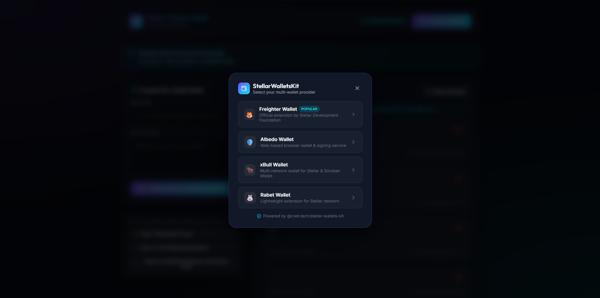
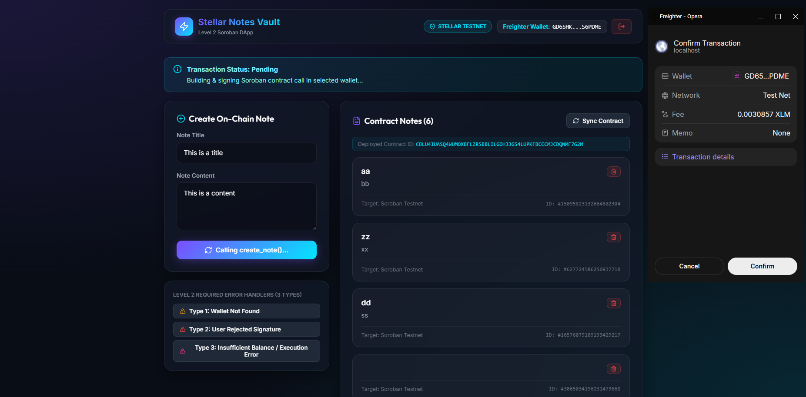
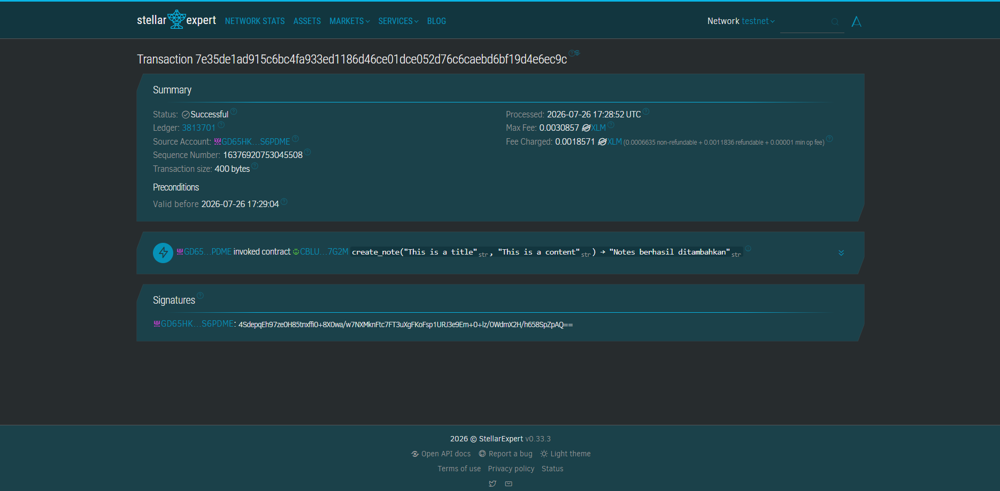

# Stellar Notes Vault — Level 2 (Soroban DApp & Multi-Wallet)

**Stellar Notes Vault** is a decentralized Web3 note-taking application built on the **Stellar Testnet** using **Soroban Smart Contracts**, **React 18**, **TypeScript**, **Vite**, and **`@creit.tech/stellar-wallets-kit`**.

This repository satisfies all **Level 2** requirements: multi-wallet support, contract deployment on testnet, reading/writing on-chain data, handling 3 distinct error types, and tracking transaction statuses in real-time.

---

## 📋 Deployed Contract & Verification Details

* **Deployed Contract Address**:  
  [`CBLU4IUASQ4WUMOXBFLZRSBBLILGOH33GS4LUPKFBCCCMJCDQNMF7G2M`](https://stellar.expert/explorer/testnet/contract/CBLU4IUASQ4WUMOXBFLZRSBBLILGOH33GS4LUPKFBCCCMJCDQNMF7G2M)
* **Verifiable Transaction Hash (Stellar Explorer)**:  
  [`30c9d498792003619cdc9a2dbb27b4eff4f5e46748daa04ade09e26e77d384ea`](https://stellar.expert/explorer/testnet/tx/30c9d498792003619cdc9a2dbb27b4eff4f5e46748daa04ade09e26e77d384ea)
* **Target Network**: Stellar Testnet
* **Soroban RPC Server**: `https://soroban-testnet.stellar.org`

---

## ✨ Key Level 2 Features

1. **Multi-Wallet Support (`StellarWalletsKit`)**:
   - Connect using **Freighter**, **Albedo**, **xBull**, or **Rabet**.
2. **Soroban Smart Contract Invocations**:
   - **Read**: Simulates read-only contract calls to `get_notes()` to sync on-chain notes.
   - **Write**: Invokes `create_note(title, content)` to record notes on Soroban instance storage.
   - **Delete**: Invokes `delete_note(id)` to remove records on-chain.
3. **3 Handled Error Types**:
   - ❌ **Type 1: Wallet Not Found / Connection Failure**: Catches missing wallet extensions and prompts installation.
   - ❌ **Type 2: User Rejected Signature**: Gracefully handles transaction cancellation in wallet popups.
   - ❌ **Type 3: Insufficient Balance / Execution Failure**: Catches gas fee issues or simulation errors.
4. **Real-time Transaction Tracking**:
   - Live state updates showing `Pending` $\rightarrow$ `Success` with verifiable StellarExpert explorer links.

---

## 📸 Level 2 Screenshots

### 1. Wallet Options Available (StellarWalletsKit)

> Shows multi-wallet selection modal supporting Freighter, Albedo, xBull, and Rabet.

### 2. Contract Call & Real-time State Synchronization

> Demonstrates executing contract functions and rendering real-time on-chain notes directly from Soroban contract storage.

### 3. Verifiable Transaction Hash on Stellar Explorer

> Displays the verified transaction hash on Stellar Explorer (`30c9d498792003619cdc9a2dbb27b4eff4f5e46748daa04ade09e26e77d384ea`).

---

## 💻 Local Setup Instructions

### Prerequisites
- [Node.js](https://nodejs.org/) (v18 or higher)
- [Freighter Wallet](https://www.freighter.app/) extension (or any supported Stellar wallet) set to **Testnet** mode.

### 1. Clone & Install
```bash
git clone https://github.com/IAmBaghas/stellar-soroban-risein.git
cd stellar-soroban-risein
npm install
```

### 2. Run Development Server
```bash
npm run dev
```
Open your browser at `http://localhost:5173`.

### 3. Build for Production
```bash
npm run build
```

---

## 📜 Soroban Smart Contract Code

The Rust smart contract source code is located in `contracts/notes`:
* `contracts/notes/src/lib.rs` (NotesContract implementation)
* Build target command:
  ```bash
  cd contracts/notes
  stellar contract build
  ```

---

## 📄 License
MIT License — Built for the Stellar Soroban RiseIn Bootcamp.
